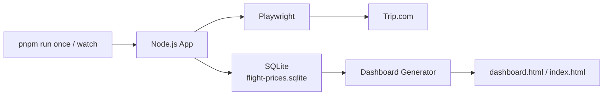
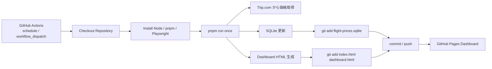
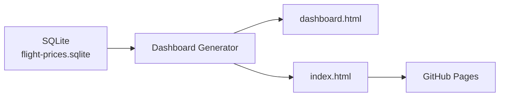

# Flight Price Monitor

Node.js と Playwright を使って航空券価格を定期的に取得し、SQLite に履歴を保存して、GitHub Pages 上に Dashboard として公開する航空券価格監視アプリです。

このプロジェクトは、特定ルートの航空券価格を継続的に追跡し、価格変化を見える化することを目的に開発しました。ローカル PC での手動実行から始まり、現在は GitHub Actions による定期自動実行と、GitHub リポジトリへのデータ永続化に対応しています。

## プロジェクト概要

このアプリは、Trip.com の航空券検索ページを Playwright で開き、設定された条件に合う航空券価格を取得します。取得した価格は SQLite に保存され、履歴データをもとに `dashboard.html` と `index.html` が生成されます。

生成された `index.html` は GitHub Pages で公開できるため、ブラウザから最新の価格状況と履歴を確認できます。

開発目的は次のとおりです。

- 航空券価格の変化を手作業ではなく自動で記録する
- ブラウザ操作、データ保存、定期実行、静的ページ公開までを一通り実装する
- GitHub Actions を使い、ローカル PC に依存しない定期監視へ移行する
- 研修成果物・ポートフォリオとして説明できる構成にする

## 主な機能

- **航空券価格取得**  
  Playwright で Trip.com を開き、設定されたルート・日付・航空会社・時刻条件に合う価格を取得します。

- **価格履歴保存**  
  取得した価格、検索日時、航空会社、便情報、通貨、マッチ状態などを SQLite の `price_history` に保存します。

- **Dashboard 表示**  
  SQLite の履歴データから `dashboard.html` と `index.html` を生成します。Dashboard では最新価格、履歴、グラフ、異常価格記録を確認できます。

- **自動実行**  
  GitHub Actions の `schedule` により、定期的に価格取得処理を実行します。`workflow_dispatch` による手動実行にも対応しています。

- **データ永続化**  
  GitHub Actions Runner は実行ごとに破棄されますが、更新後の `flight-prices.sqlite` を GitHub リポジトリへ commit / push することで、履歴データを保持します。

- **GitHub Pages 公開**  
  生成された `index.html` を GitHub Pages で公開し、Dashboard として閲覧できます。

## システム構成

### ローカル実行時の構成

ローカルでは、開発者の PC 上で Node.js アプリを実行します。



`pnpm run once` は 1 回だけ検索します。`pnpm run watch` は起動直後に 1 回検索し、その後は `config/index.js` の cron 設定に従って定期実行します。

### GitHub Actions 移行後の構成

現在の自動実行は `.github/workflows/flight-monitor.yml` で管理されています。



GitHub Actions 上でも、基本的な処理はローカル実行と同じです。違いは、実行後に SQLite と HTML をリポジトリへ push し、次回実行時に前回までの履歴を引き継ぐ点です。

## 使用技術

- **Node.js**  
  アプリ本体の実行環境です。`package.json` では Node.js `>=22.5.0` を前提にしています。

- **Playwright**  
  Trip.com のページを実際のブラウザとして開き、JavaScript で描画された検索結果から価格情報を取得します。

- **SQLite / node:sqlite**  
  価格履歴を保存するために使用しています。外部 DB サーバーを用意せず、`flight-prices.sqlite` という 1 ファイルで管理します。

- **GitHub Actions**  
  定期実行、手動実行、依存関係インストール、価格取得、データ commit / push を自動化します。

- **GitHub Pages**  
  生成された `index.html` を Dashboard として公開します。

- **HTML / CSS / JavaScript**  
  Dashboard の表示、グラフ描画、言語切り替え UI に使用しています。

- **Chart.js**  
  Dashboard の価格推移グラフに使用しています。

## ディレクトリ構成

現在の主な構成は次のとおりです。

```text
.
├─ .github/
│  └─ workflows/
│     └─ flight-monitor.yml        GitHub Actions の定期実行 workflow
├─ config/
│  └─ index.js                     ルート、対象便、通知、保存先などの設定
├─ src/
│  ├─ app/
│  │  ├─ index.js                  アプリのエントリーポイント
│  │  ├─ monitor.js                1 回分の監視処理を統括
│  │  ├─ nextQueryTime.js          次回実行予定時刻の表示用ロジック
│  │  ├─ scheduler.js              ローカル watch 用の定期実行制御
│  │  └─ update.js                 ローカルでの更新・commit・push 用スクリプト
│  ├─ dashboard/
│  │  ├─ generator.js              Dashboard HTML 生成
│  │  └─ locales.js                Dashboard の日本語 / 中国語 UI 文言
│  ├─ database/
│  │  └─ index.js                  SQLite 初期化、保存、取得処理
│  ├─ git/
│  │  └─ publisher.js              GitHub Pages 用ファイルの publish 処理
│  ├─ notifier/
│  │  └─ email.js                  メール通知処理
│  ├─ scraper/
│  │  ├─ BaseScraper.js            scraper の基底クラス
│  │  ├─ TripScraper.js            Trip.com 価格取得処理
│  │  └─ index.js                  scraper 登録
│  ├─ server/
│  │  └─ index.js                  Dashboard 配信用 Express サーバー
│  └─ utils/
│     ├─ logger.js                 ログ・診断ファイル出力
│     └─ time.js                   日付・時刻ユーティリティ
├─ dashboard.html                  生成済み Dashboard
├─ index.html                      GitHub Pages 公開用 Dashboard
├─ flight-prices.sqlite            価格履歴 SQLite データベース
├─ package.json                    npm scripts と依存関係
├─ pnpm-lock.yaml                  pnpm lockfile
└─ README.md
```

## ローカル環境での実行方法

### 1. 依存関係をインストール

pnpm を使う場合:

```bash
corepack enable
corepack pnpm install
```

Windows の場合:

```powershell
corepack.cmd pnpm install
```

Playwright の Chromium をインストールします。

```bash
corepack pnpm exec playwright install chromium
```

Windows の場合:

```powershell
corepack.cmd pnpm exec playwright install chromium
```

### 2. 1 回だけ価格取得する

```bash
pnpm run once
```

Windows の場合:

```powershell
corepack.cmd pnpm run once
```

### 3. ローカルで定期実行する

```bash
pnpm run watch
```

watch モードでは、起動直後に 1 回検索したあと、`config/index.js` の `scheduler.cronExpressions` に従って定期実行します。

### 4. Dashboard をローカル配信する

```bash
pnpm run serve
```

起動後、ブラウザで次にアクセスします。

```text
http://localhost:3000/
```

### 5. ローカルから更新・push する

```bash
pnpm run update
```

Windows の場合:

```powershell
corepack.cmd pnpm run update
```

## GitHub Actions について

GitHub Actions の設定は `.github/workflows/flight-monitor.yml` にあります。

現在の workflow は次の 2 種類の起動方法に対応しています。

- `schedule`
- `workflow_dispatch`

### 定期実行

workflow では次の cron が設定されています。

```yaml
schedule:
  - cron: "0 */4 * * *"
```

これは UTC 基準で 4 時間ごとに実行される設定です。GitHub Actions の cron は UTC で解釈されるため、日本時間とは 9 時間ずれます。

### 手動実行

`workflow_dispatch` が設定されているため、GitHub の Actions 画面から手動で workflow を実行できます。発表や動作確認のときに、スケジュールを待たずに実行できる点が便利です。

### 実行内容

workflow の主な処理は次のとおりです。

1. リポジトリを checkout する
2. Node.js 24 をセットアップする
3. pnpm をセットアップする
4. 依存関係をインストールする
5. Playwright Chromium をインストールする
6. Git のユーザー情報を設定する
7. `pnpm run once` を実行する
8. 更新された SQLite と HTML を commit / push する

workflow には `permissions: contents: write` が設定されており、実行結果をリポジトリへ push できるようになっています。

## データ永続化について

GitHub Actions の Runner は、実行が終わると環境ごと破棄されます。そのため、Runner 内だけに SQLite を保存しても、次回実行時には履歴が残りません。

このプロジェクトでは、価格取得後に次のファイルを GitHub リポジトリへ commit / push します。

```text
flight-prices.sqlite
index.html
dashboard.html
```

これにより、次回の GitHub Actions 実行時には、checkout したリポジトリ内に前回までの `flight-prices.sqlite` が存在します。結果として、Runner が毎回新しくなっても価格履歴を引き継げます。

つまり、SQLite ファイル自体をリポジトリで管理することで、外部データベースを使わずに履歴データを永続化しています。

## GitHub Pages Dashboard について

Dashboard は `src/dashboard/generator.js` によって生成されます。保存済みの SQLite データを読み込み、次の 2 つの HTML を出力します。

```text
dashboard.html
index.html
```

GitHub Pages では通常 `index.html` がトップページとして表示されるため、`index.html` を生成・更新することで Dashboard を公開できます。

更新フローは次のとおりです。



Dashboard では、最新価格、直近履歴、価格推移グラフ、異常価格記録を確認できます。また、UI は日本語と簡体字中国語の切り替えに対応しています。

## 補足

このプロジェクトでは、Trip.com のページ構造変更や読み込み失敗に備えて、エラー発生時に `work/logs/`、`work/screenshots/`、`work/debug-html/` へ診断情報を保存する仕組みも用意しています。

GitHub Pages に公開する対象は Dashboard 用 HTML です。ログやスクリーンショットなどの調査用ファイルは、通常の公開対象には含めません。
